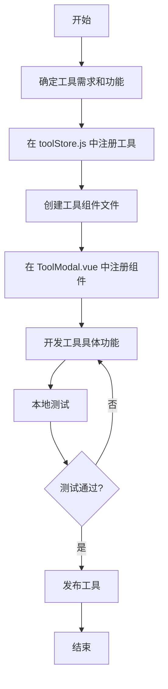

# DevTools 开发流程指南

## 目录

- [概述](#概述)
- [工具开发流程](#工具开发流程)
- [开发流程图](#开发流程图)
- [详细步骤](#详细步骤)
  - [1. 确定工具需求](#1-确定工具需求)
  - [2. 在工具商店中注册](#2-在工具商店中注册)
  - [3. 创建工具组件](#3-创建工具组件)
  - [4. 注册工具组件](#4-注册工具组件)
  - [5. 开发工具功能](#5-开发工具功能)
  - [6. 测试工具](#6-测试工具)
  - [7. 发布工具](#7-发布工具)
- [最佳实践](#最佳实践)
- [常见问题](#常见问题)

## 概述

DevTools 是一个基于 Vue 3 和 Element
Plus 的在线工具集合，提供了丰富的编程辅助工具。本文档将指导你如何在 DevTools 平台上开发和集成一个新工具。

## 工具开发流程

开发一个新工具的基本流程如下：

1. 确定工具需求和功能
2. 在工具商店（toolStore.js）中注册工具信息
3. 在对应分类下创建工具组件
4. 在 ToolModal.vue 中注册工具组件
5. 开发工具具体功能
6. 测试工具功能
7. 发布工具

## 开发流程图



## 详细步骤

### 1. 确定工具需求

首先，明确你要开发的工具的具体功能和用途：

- 工具名称
- 工具图标（使用 Font Awesome 图标）
- 工具分类（代码相关、文本处理、数据格式等）
- 工具描述
- 主要功能点

### 2. 在工具商店中注册

在 `src/stores/toolStore.js` 文件中的 `tools` 数组中添加新工具信息：

```js
// 在 tools 数组中添加新工具
{
    id: 'your-tool-id',  // 工具唯一标识，使用小写字母和连字符
    name: '你的工具名称',
    icon: 'fas fa-icon-name',  // Font Awesome 图标类名
    category: 'category-id',   // 已有类别：code, text, data 等
    categoryName: '分类名称',   // 显示名称：代码相关、文本处理等
    description: '工具的简短描述',
},
```

如果需要添加新分类，在 `categories` 数组中添加：

```js
{
    id: 'new-category',
    name: '新分类名称',
    icon: 'fas fa-category-icon',
    count: tools.filter((t) => t.category === 'new-category').length,
},
```

### 3. 创建工具组件

根据你的工具类别，在相应目录中创建组件文件：

- 代码相关工具：`src/components/tools/code/YourTool.vue`
- 文本处理工具：`src/components/tools/text/YourTool.vue`
- 数据格式工具：`src/components/tools/data/YourTool.vue`

组件基本结构如下：

```vue
<script setup>
import { ref } from 'vue'

// 工具状态数据
const input = ref('')
const output = ref('')

// 工具方法
function processData(data) {
  // 实现你的工具逻辑
  return result
}

// 事件处理函数
const handleProcess = () => {
  output.value = processData(input.value)
}
</script>

<template>
  <div class="your-tool">
    <!-- 工具界面 -->
    <el-row :gutter="20">
      <!-- 输入部分 -->
      <el-col :span="12">
        <!-- ... -->
      </el-col>

      <!-- 输出部分 -->
      <el-col :span="12">
        <!-- ... -->
      </el-col>
    </el-row>

    <!-- 操作按钮 -->
    <div class="actions">
      <el-button type="primary" @click="handleProcess">处理</el-button>
    </div>
  </div>
</template>

<style scoped>
/* 组件样式 */
</style>
```

### 4. 注册工具组件

在 `src/components/layout/ToolModal.vue` 文件中导入并注册你的工具组件：

```vue
<script setup>
import { useToolStore } from '@/stores/toolStore'
// 导入现有工具组件
import RegexTester from '@/components/tools/code/RegexTester.vue'
import Base64Converter from '@/components/tools/text/Base64Converter.vue'
import JsonFormatter from '@/components/tools/data/JsonFormatter.vue'
// 导入你的新工具组件
import YourTool from '@/components/tools/category/YourTool.vue'

const store = useToolStore()
</script>

<template>
  <el-dialog
    v-model="store.currentTool"
    :title="store.currentTool?.name"
    width="80%"
    :before-close="store.closeTool"
    class="tool-modal"
    append-to-body>
    <!-- 现有工具组件 -->
    <RegexTester v-if="store.currentTool?.id === 'regex'" :key="`regex-${store.currentTool.id}`" />
    <Base64Converter
      v-else-if="store.currentTool?.id === 'base64'"
      :key="`base64-${store.currentTool.id}`" />
    <JsonFormatter
      v-else-if="store.currentTool?.id === 'json'"
      :key="`json-${store.currentTool.id}`" />
    <!-- 你的新工具组件 -->
    <YourTool
      v-else-if="store.currentTool?.id === 'your-tool-id'"
      :key="`your-tool-${store.currentTool.id}`" />
    <div v-else>
      <p>工具内容正在开发中...</p>
    </div>
  </el-dialog>
</template>
```

### 5. 开发工具功能

在工具组件中，实现具体的工具功能逻辑：

1. 创建必要的响应式数据（ref, reactive）
2. 实现处理逻辑的函数
3. 设计用户界面
4. 添加用户交互事件处理
5. 编写组件样式

遵循以下设计原则：

- 输入和输出区域清晰分开
- 操作按钮易于理解和使用
- 提供适当的错误处理和反馈
- 保持设计风格与整体应用一致

### 6. 测试工具

对工具进行全面测试：

1. 功能测试：确保工具的核心功能正常工作
2. 界面测试：检查 UI 元素是否正常显示和交互
3. 错误处理：测试各种边缘情况和错误输入
4. 响应式测试：确保在不同屏幕尺寸下正常显示

### 7. 发布工具

当工具测试通过后，更新版本并发布：

1. 更新 README.md 中的工具列表
2. 提交代码并创建合并请求
3. 经审核后，工具将被整合到主应用中

## 最佳实践

- **组件化设计**：将复杂功能拆分为小型、可重用的组件
- **错误处理**：增加适当的错误处理和用户友好的错误提示
- **性能优化**：处理大量数据时考虑性能优化
- **响应式设计**：确保工具在不同设备上可用
- **代码注释**：为复杂逻辑添加清晰的注释
- **统一风格**：遵循项目的代码和设计风格

## 常见问题

**Q: 如何选择合适的图标？**  
A: 在 [Font Awesome](https://fontawesome.com/icons) 网站上查找与你的工具功能相关的图标。

**Q: 如何处理大量数据？**  
A: 对于处理大量数据的工具，考虑使用 Web Workers 或分批处理技术。

**Q: 我能否添加新的工具分类？**  
A: 可以，在 toolStore.js 中按照现有格式添加新的分类，并确保正确计算该分类下的工具数量。
